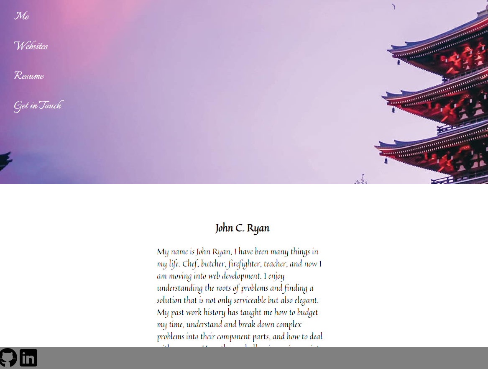
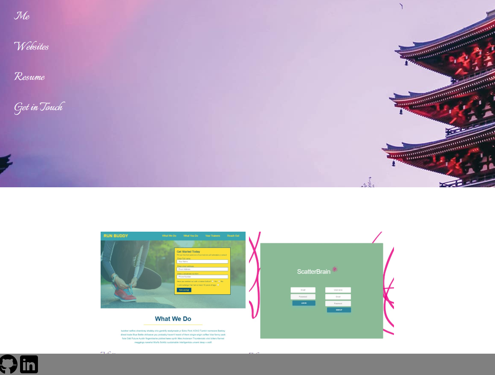

This project was bootstrapped with [Create React App](https://github.com/facebook/create-react-app).

<h1 align="center">John Ryan Portfolio</h1>

  

## Table of Contents
- [Description](#description)
- [Installation](#install)
- [Usage](#usage)
- [Questions](#questions)

## Description
### This application uses React, SCSS, Node, JS, CSS, HTML. I built this simple webpage to show my stack and what I have learned since starting in CS. All contact info is up to date please feel free to reach out! 

### Screenshot of the VSCode console injecting the SQL commands via the JS models.

### Screenshot of the program Insomnia, used to test the routes and tables.

## Usage
Take a look! I hope you enjopy what you see.

## Install
If you want a working version on local

npm install create-react-app  --> this was created in that framework

npm start

npm install nodemon "if you want an easier time"

## Questions
## Contact me at:
### [JCSRyan](https://github.com/jcsryan)
### JohnConnorSRyan@gmail.com